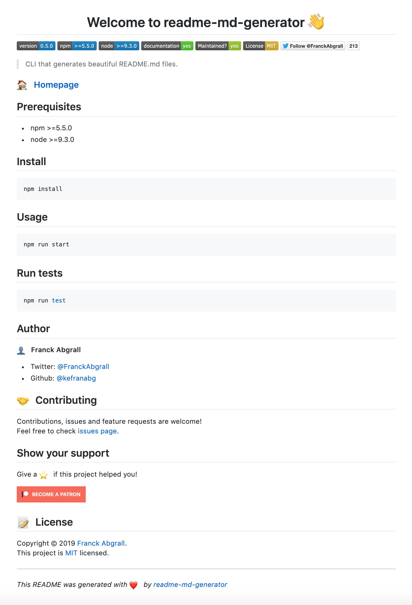

# Exercise1
This exercise serves to introduce Markdown syntax. It is very useful to write files introducing an application quickly and without much overhead. One function is to easily italicise and bold (or both) text. For example one asterisk \*before\* and after something will produce *italic text*, while two \*\*asterisks\*\* will produce **bold text**. This can also be combined for three \*\*\*asterisks\*\*\* to create ***bold italic*** text.

## Images

You can also add images to a Markdown file by typing an exclamation mark \! followed by square brackets for the alt text and regular brackets for the image path: ``. This will automatically insert the image at its location.

Unfortunately Markdown does not natively support captions but they can be added if the rendering application can process HTML code. In that case you can insert an image with HTML and add a caption.

## Further Reading

If you wish to learn more about Markdown you can find a comprehensive guide [here](https://www.markdownguide.org/basic-syntax/)
